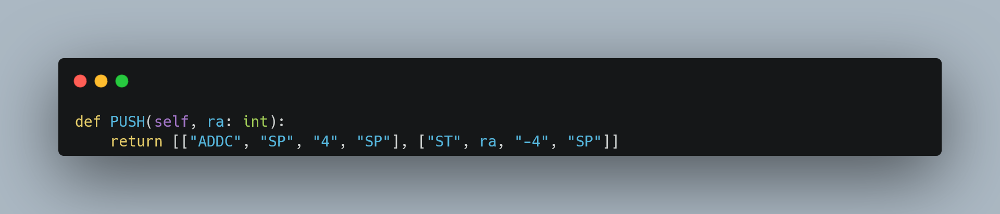

# Beta Emulator V2

## Introduction

This project serves to act as an emulator for the Beta ISA taught in SUTD's 50.002 Computation Structures module.

If creating your own ISA for the 1D project, you may use this as a starter for extending and defining your own opcodes.

## Installation

### Requirements

1. You have to have a valid install of Python 3 (`>=python3.8`)

### Steps

In the base directory of the project, create a new virtual environment:

```Shell
python3 -m venv venv
```

On Windows, you can activate it with:

```Shell
.\venv\Scripts\activate
```

On MacOS / Linux you can activate it with:

```Shell
source ./venv/bin/activate
```

Once the virtual environment is activated, install the required packages from the included `requirements.txt` file:

```Shell
pip install -r requirements.txt
```

## Running via Docker

1. Build the image from the root of the project with the following command:

```Shell
docker build -t beta_emulator .
```

2. Then run and attach to the container:

```Shell
docker run -it beta_emulator /bin/bash
```

## Running the Application

### Normal Operation

To start the emulator, ensure that you are in your virtual environment, and in the base directory of the project, then enter the command:

```Shell
python beta_emulator -e
```

To instead assemble your code, you can instead use the following flags:

- `-i`: Specify the filepath of your instruction memory
- `-d`: Specify the filepath of your data memory
- `-x`: Output data in hex

An example command would be:

```Shell
python beta_emulator -i uasm_files/factorial_iterative/instr.txt -d uasm_files/factorial_iterative/mem.txt
```

### Development Operation

While developing, you may want to see the output of print statements and more that you've inserted in your code.

Textual allows you to do so by first opening a dev console in a separate window.

To open a dev console, run the following command:

```Shell
textual console
```

You can then create a new terminal instance, navigate to the base directory of the project, then enter your virtual environment again. After doing so, enter the following command:

```Shell
textual run --dev beta_emulator.app:EmulatorApp
```

## Using the Emulator

### Selecting your Files

When you first load the emulator, you shoule be on the `File Selector` tab:


Here, you can select your instruction memory file from the left file-picker, and, if you have one, your data memory file in the right file-picker.

The default location to store files is the `uasm_files` directory in the project. But, if you have your files stored elsewhere on your machine, you can update the `Base Path` input field and click `Load Path` to see the contents of the selected directory instead.

Once your files have been selected, you can click the `Load Files` button in the bottom left of the window.

> Note: After clicking the `Load Files` button, please be patient - the Textual app takes some time to update all changes, so don't panic and try to force-close the terminal :ghost:

### Using the Emulator

Once your files have been loading, you will be brought to the `Emulator` tab:


To focus on the window, click anywhere within the emulator's interface. To check whether or not the window is in focus, the keybindings for running the emulator should now show up in the footer of the window:


- In the left panel,  you can see your instruction memory, both in its opcode form, and its assembled form
- In the middle panel, you can see the contents of your registers
- In the right panel, you can see the contents of your data memory

To toggle between output formats for your data, press `T`.

- This will cycle between binary, hexadecimal, and signed integer representation. You can see which representation is currently active in the top bar, represented by `BIN`, `HEX`, and `INT`, respectively.

To enable automatic execution of the program, press `P`.

- This will step through the program until it reaches a `HALT` or illegal instruction

To execute the current loaded instruction, press `E`.

- The highlighted row in the instruction memory panel indicates the currently-loaded instruction
- The highlighted row in the registers panel indicates the last-accessed register
- The highlighted row in the data memory panel indicates the last-access data memory address

To step backwards through execution, press `Q`.

- This undoes the last-executed instruction, and restores any data changed during the execution of the instruction

To reset the emulator to the start of the program, press `R`.

- This resets the program counter to 0, zeroes all registers, and restores the instruction and data memory to their original states

### Seeing your Output

If you navigate to the `Output` tab, this is where you can see whatever output you desire from your program (and also most likely the part you will need to modify for your own use).

Currently, the output is set up as a 64x32 pixel screen that outputs the contents of the data memory (which acts as the screen buffer).

To see the screen in action, you may load the instruction and data memory found in `./uasm_files/output_test/`.

> Note that because of the weird focus issue faced by tabbed applications, you may have to navigate from the `Emulator` tab to the `Output` tab by pressing `3` first, then executing the program (with `Q`, `E`, `P`, etc.)


### Hotkey Reference

| Key | Detail |
|-----|--------|
| D | Toggle Dark Mode |
| Esc | Quit |
| 1 | Navigate to File Selector |
| 2 | Navigate to Emulator |
| 3 | Navigate to Output |
| Q | Step Backward Through Execution |
| E | Step Forward Through Execution |
| P | Toggle Automatic Execution |
| R | Reset Emulator |
| T | Toggle Data Format |

## Testing

Basic tests have been written to ensure that changes don't break the emulator. To run these tests, from the base directory, run the following command:

```Shell
pytest tests
```

## Extending the Emulator

### Configuring the Emulator

You can configure the emulator by updating the class attributes of the `Emulator` class in `./beta_emulator/emulator.py`.

| Class Attribute | Detail |
|-----------------|--------|
| NUM_REGS | Number of registers used by the emulator |
| ZP, XP, SP, LP, BP | Index of register corresponding to these special registers |
| REG_WIDTH | Width of each register in bytes |
| INSTR_MEM_SIZE | Size of the instruction memory in bytes |
| DATA_MEM_SIZE | Size of the data memory in bytes |
| INSTR_WIDTH | Width of each instruction in bytes |
| OPCODE_WIDTH | Width of opcode in bits |
| LITERAL_WIDTH | Width of literal in bits |
| DATA_WIDTH | Width of each memory word in bytes |

### Creating New Opcodes

This emulator is set up to follow the standard Beta ISA taught during 50.002 Computation Structures, which means the opcode format follows [this](https://drive.google.com/file/d/1v-eaGuxa1W5HPPNi_shvdS1g5z99if3_/view).

To create a new instruction, simply refer to any of the instructions (OP, OPC, others) in `./beta_emulator/emulator.py`. For example, the `ADD` instruction can be implemented as shown:


Breaking down the function:

- The name of the function will determine what is expected in the assembly file provided to the emulator
  - If the function is named `ADD`, the assembler will look for instructions with the name `ADD` when parsing
- The first line (`self.write_debug_frame`) is used to generate the frame information used by the emulator for stepping backward
  - If you are modifying a register in this instruction, call `write_debug_frame` with the index of the register you are intending to modify as the argument `register_idx`
  - If you are writing to data memory in this instruction, call `write_debug_frame` with the address in the data memory you are intending to modify as the argument `data_memory_address`
    - If you don't modify any register's contents, or any address in data memory, call `write_debug_frame` with no arguments; it will still need to log information about the program counter
- The second line is an example of how to modify the contents of a register:
  - The contents of register `ra` (and `rb`) are retrieved (`self.registers[ra].get()`),
  - And added together before being written to register `rc` (`self.registers[rc].set()`)
- The program counter is incremented (`self.program_counter += 4`)
- And the assembled bytecode is returned by the function
  - If your instruction follows the OP instruction format, you can pass your arguments to the `self._build_op_output()` function
  - Likewise, if your instruction follows the OPC instruction format, you can pass your arguments to the `self._build_opc_output()` function
  - Otherwise, you have to create your own function that can assemble the required bytecode
    - You can refer to the function definition of the build functions to get an idea of what is required and how you can accomplish it

### Registering Macros

Macros can be separated into two types:

- Single-instruction macros that are used to make expressing certain common operations easier (e.g. `BEQ(Ra, label)` is a macro for `BEQ(Ra, label, R31)`)
- Multi-instruction macros (e.g. `PUSH(Ra)` is a macro for `ADDC(SP, 4, SP)` then `ST(ra, -4, SP)`)

#### Single-Instruction Macros

Single instruction macros can be implemented using the `@methoddispatch` decorator. This decorator enables us to register multiple functions with the same name that only differ by argument count.

For example, `BNE` and its macros can be expressed as the following:


- The main BNE instruction is decorated with the `@methoddispatch` decorator, and its function definition is written as per usual
- Any subsequent macro of BNE is instead defined with its name as `_`, and decorated with `@BNE.register`, registering it as a macro of `BNE`

> If you are interested in how this was accomplished, refer to the `methoddispatch` function definition at the top of `./beta_emulator/emulator.py`. (I would've used something like `functools.singledispatch` but that only supports overloading based on the type of the first argument, rather than the number of arguments, hence I had to bodge my own implementation.)

#### Multi-Instruction Macros

Multi-instruction macros have to be cheesed a little more than single-instruction macros, simply due to the way the assembler in this emulator works. Instead of registering a function with the `@methoddispatch` decorator like single-instruction macros, we instead return a list of instructions that represent the desired functionality of the macro.

For example, `PUSH` is expressed as the following:



### Updating the Output Interface

Your best bet would be to go read up on [Textual](https://textual.textualize.io/) or [Rich](https://rich.readthedocs.io/) on how to create pretty interfaces for your own version, but you can also refer to the `OutputWidget` in `./beta_emulator/app.py` to get an understanding of how the data memory is being rendered as a black-and-white screen in the default emulator.

### Issues and Requests

If you find any issues, please help to raise them on the repository you cloned this from, and include details on the steps needed to reproduce the issue.

For requests, feel free to submit PRs :smile: